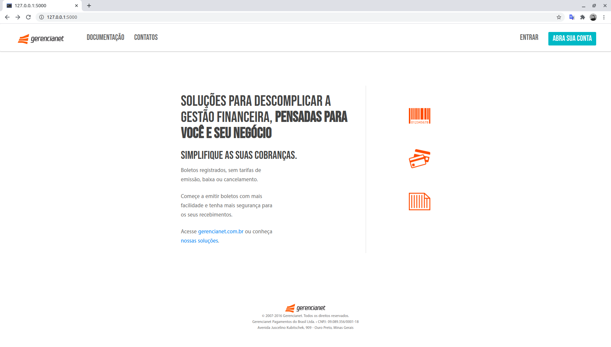

# API Gerencianet

Pequena aplicação para emissão de cobranças via boleto bancário, cartão de crédito ou carnês, desenvolvida utilizando Flask para integrar com os serviços de pagamento prestados pela [Gerencianet](http://gerencianet.com.br).

### Python

version 3.7.4

### Pacotes utilizados

```
gerencianet==1.1.0
Flask==1.1.1
```


